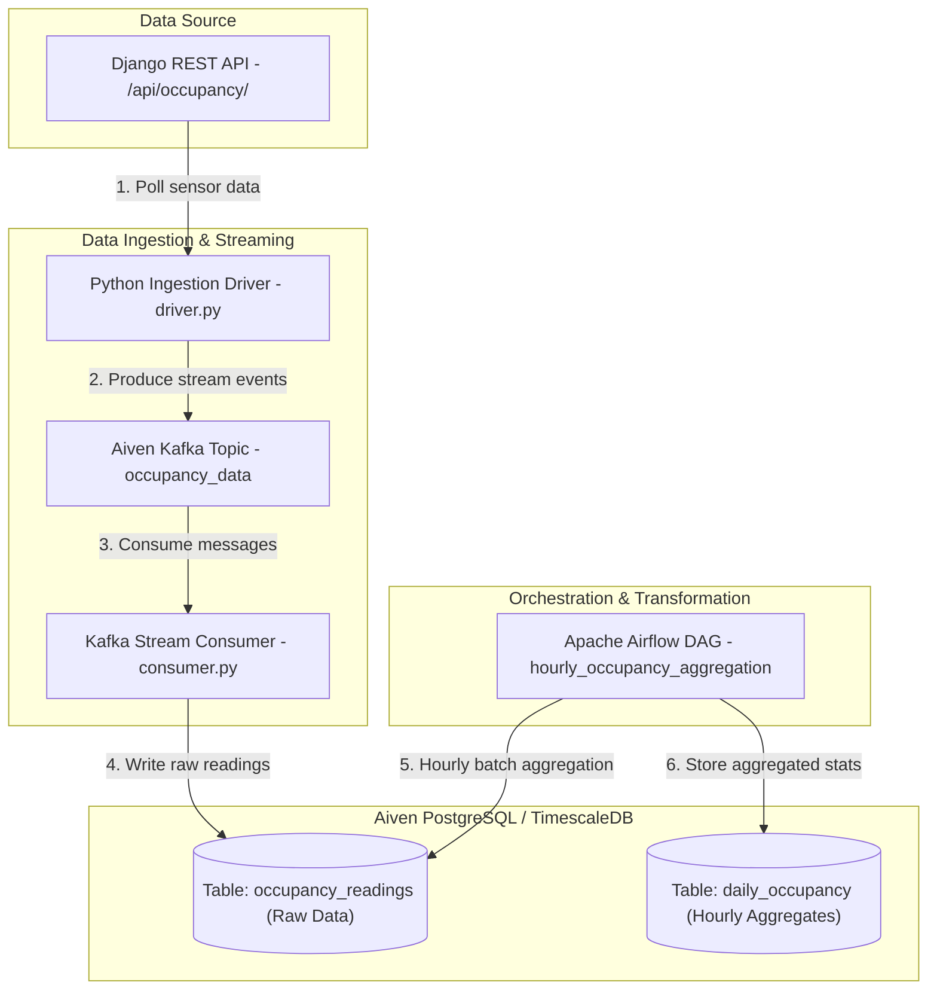

# Architecture Diagram

```mermaid
graph TD
    subgraph Data_Source ["Data Source"]
        API["Django REST API - /api/occupancy/"]
    end

    subgraph Ingestion_Layer ["Data Ingestion & Streaming"]
        Driver["Python Ingestion Driver - driver.py"]
        Kafka["Aiven Kafka Topic - occupancy_data"]
        Consumer["Kafka Stream Consumer - consumer.py"]
    end

    subgraph Storage_Layer ["Aiven PostgreSQL / TimescaleDB"]
        RawDB[("Table: occupancy_readings (Raw Data)")]
        AggDB[("Table: daily_occupancy (Hourly Aggregates)")]
    end

    subgraph Orchestration_Layer ["Orchestration & Transformation"]
        Airflow["Apache Airflow DAG - hourly_occupancy_aggregation"]
    end

    API -->|"1. Poll sensor data"| Driver
    Driver -->|"2. Produce stream events"| Kafka
    Kafka -->|"3. Consume messages"| Consumer
    Consumer -->|"4. Write raw readings"| RawDB
    Airflow -->|"5. Hourly batch aggregation"| RawDB
    Airflow -->|"6. Store aggregated stats"| AggDB
```
